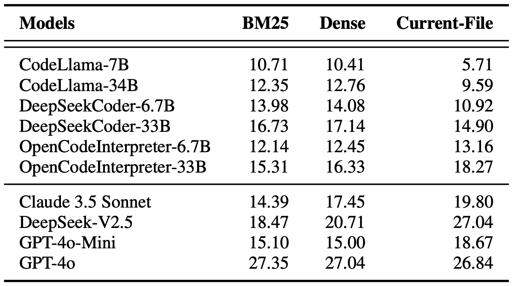

# Can Language Models Replace Programmers for Coding? REPOCOD Says ‘Not Yet’

We create REPOCOD, a code generation benchmark with 980 problems collected from 11 popular real-world projects, with more than 58% of them requiring repository-level context information. In addition, REPOCOD has the longest average canonical solution length (331.6 tokens) and the highest average cyclomatic complexity (9.00) compared to existing benchmarks. On average, each task in REPOCOD includes 313.5 developer-written test cases for better correctness evaluation. In our evaluations on ten LLMs, none of the models achieves more than 30 pass@1 on REPOCOD, disclosing the necessity of building stronger LLMs that can help developers in real-world software development.

## Updates:
05/15/2025: RepoCod is accepted to **ACL 2025 main**!

10/30/2024: Our preprint available at: [ArXiv](https://arxiv.org/abs/2410.21647v1)

10/30/2024: Our dataset is available on Huggingface: [link](https://huggingface.co/datasets/lt-asset/REPOCOD)

## ❓ Why REPOCOD?

REPOCOD pushes beyond conventional benchmarks with **repository-level tasks**, **complex code structures**, and **rigorous correctness evaluation**.

### 🔍 Compared to **SWE-Bench**
- **Task Type**:  
  - **REPOCOD**: General code generation  
  - **SWE-Bench**: Bug fixing via GitHub issue resolution
- **Test Coverage**:  
  - REPOCOD has **2.6× more test cases per task**  
    - 313.5 vs. SWE-Bench’s 120.8

### 🔍 Compared to **HumanEval**, **MBPP**, **CoderEval**, and **ClassEval**
- **Scale & Diversity**:  
  - 980 tasks from 11 real-world Python projects
- **Whole-function generation**:  
  - Not just short snippets or toy examples
- **Repository-level context**:  
  - Requires understanding imports, dependencies, and project structure
- **Evaluation**:  
  - Validation through extensive, developer-written test cases
- **Complexity**:  
  - Longest average canonical solution: **331.6 tokens**  
  - Highest average cyclomatic complexity: **9.00**

---

## Usage

### Install Dependencies

Please use the following commands to install the necessary packages for inference and evaluation using REPOCOD.
```
pip install --upgrade pip
pip install -r requirements.txt
```

### Inference
Please refer to [./inference/Inference.md](./inference/Inference.md) for using REPOCOD.

### Evaluation
To evaluate on REPOCOD, please refer to [./evaluate/Evaluate.md](./evaluate/Evaluate.md).

## Data Collection


We employ a three-stage data collection pipeline to efficiently gather target functions from popular repositories: Repository Selection, Target Function Selection, and Relevant Test Case Collection. For more details, feel free to read our paper!

## LLMs' Performance


This table shows 10 LLMs’ performance on REPOCOD, under three retrieval settings. On all retrieval methods, commercial LLMs have better performance. Specifically, GPT-4o has the best result, reaching up to 27.35 pass@1. 

However,  Compared
to their pass@1 on HumanEval (about 90 pass@1) and MBPP, SOTA LLMs are still far
away from writing real-world programs requiring repository-level information.

## Citation

```
@inproceedings{liang2024languagemodelsreplaceprogrammers,
      title={Can Language Models Replace Programmers for Coding? REPOCOD Says 'Not Yet'}, 
      author={Shanchao Liang and Yiran Hu and Nan Jiang and Lin Tan},
      year={2024},
      eprint={2410.21647},
      booktitle = "Proceedings of the 62nd Annual Meeting of the Association for Computational Linguistics (Volume 1: Long Papers)",
      month = july,
      year = "2025",
      note = {To appear},
      publisher = "Association for Computational Linguistics",
}
```